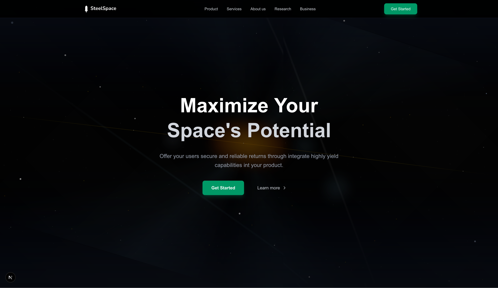

# SteelSpace

A modern, space-themed web application built with Next.js that helps users maximize their space's potential with secure and reliable returns through integrated high-yield capabilities.

## Screenshots

### Homepage

*Clean, modern design with animated galaxy background and call-to-action buttons*

## Features

- **Modern UI/UX**: Clean, space-themed design with elegant typography
- **Animated Background**: Interactive galaxy background with moving stars and particles
- **3D Elements**: Three.js integration for immersive visual experiences
- **Responsive Design**: Fully responsive layout that works across all devices
- **Performance Optimized**: Built with Next.js 15.4.2 and Turbopack for fast development
- **Smooth Animations**: Framer Motion animations for engaging user interactions
- **TypeScript**: Full TypeScript support for type-safe development

## Tech Stack

- **Framework**: Next.js 15.4.2
- **Language**: TypeScript
- **Styling**: Tailwind CSS 4.0
- **Animations**: Framer Motion
- **3D Graphics**: Three.js with React Three Fiber
- **Development**: Turbopack for fast hot reloading

## Components

- `GalaxyBackground`: Animated space background with particles
- `CleanNavbar`: Modern navigation component
- `CleanHero`: Main hero section with call-to-action
- `AnimatedBackground`: Additional background animations
- `StarField`: Starry background effects

## Getting Started

First, run the development server:

```bash
npm run dev
# or
yarn dev
# or
pnpm dev
# or
bun dev
```

Open [http://localhost:3000](http://localhost:3000) with your browser to see the result.

The page features a beautiful galaxy background with animated elements and a clean, professional interface promoting space optimization solutions.

## Development

- **Hot Reload**: Enabled with Turbopack for instant updates
- **TypeScript**: Full type checking and IntelliSense support
- **ESLint**: Code quality and consistency enforcement
- **Responsive**: Mobile-first design approach

## Project Structure

```
src/
├── app/
│   ├── page.tsx        # Main homepage
│   ├── layout.tsx      # Root layout
│   └── globals.css     # Global styles
└── components/
    ├── GalaxyBackground.tsx
    ├── CleanNavbar.tsx
    ├── CleanHero.tsx
    └── ...
```

## Build and Deploy

```bash
# Build for production
npm run build

# Start production server
npm start

# Run linter
npm run lint
```

## Deploy on Vercel

The easiest way to deploy your Next.js app is to use the [Vercel Platform](https://vercel.com/new?utm_medium=default-template&filter=next.js&utm_source=create-next-app&utm_campaign=create-next-app-readme) from the creators of Next.js.

Check out our [Next.js deployment documentation](https://nextjs.org/docs/app/building-your-application/deploying) for more details.
